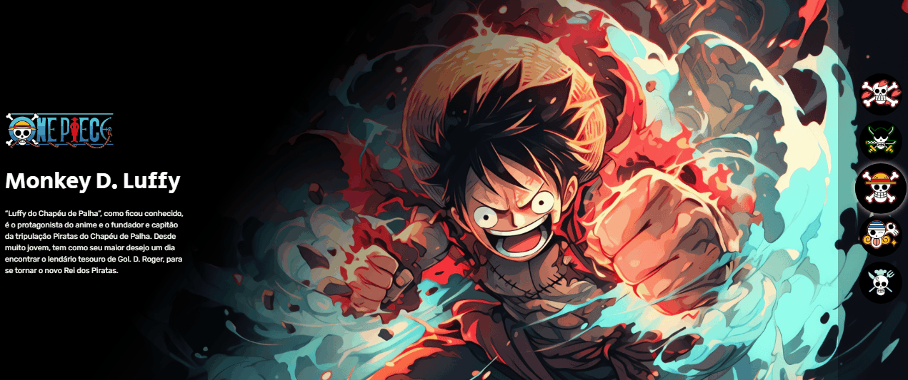

# Projeto - One Piece - Semana do Zero ao Programador Contratado!
Um projeto da semana do Zero ao Programador Contratado.🚀 Onde foi criado uma página interativa do anime One Piece.

Este projeto foi muito proveitoso, pois aprendi muito com as tecnologias utilizadas e me divertir demais pelo fato de consumir conteúdos de animes.

## Tecnologias utilizadas
- HTML
- CSS
- JS

Neste projeto fui estruturando todo o código HTML utilizando das boas práticas de programação colocando cada tag de maneira estrategica para uma melhor otimização e renderização da página, depois utilizei a tecnologia da linguagem CSS para estilizar todo o projeto e deixar ele muito mais bonito e agradável, e para finalizar conclui o projeto usando a linguagem JavaScript para dar robustez e dinâmica na página colocando toda a interatividade com o usuário final. 
